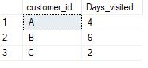

# 🍜 🍥 Case Study #1: Danny's Diner

### **1. What is the total amount each customer spent at the restaurant?**

``` sql
SELECT
 CASE
  WHEN customer_id = 'A' THEN 'Customer A'
  WHEN customer_id = 'B' THEN 'Customer B'
  WHEN customer_id = 'C' THEN 'Customer C'
  ELSE customer_id
    END AS Customers, 
 '$' + CAST(SUM(menu.price) AS varchar) AS Amount_Spent
FROM 
 [dannys_diner].[sales]
LEFT JOIN 
 [dannys_diner].[menu]
ON 
 [dannys_diner].[sales].product_id = [dannys_diner].[menu].product_id
GROUP BY 
 customer_id
ORDER BY 
 customer_id;

Answer:
| Customers   | Amount_Spent |
 ------------ | -------------|
| Customer A  |     $76      |
| Customer B  |     $74      |
| Customer C  |     $36      |

Steps:
- Use JOIN to merge sales and menu tables as customer_id is from the sales table and price is from the menu table.
- Use SUM and GROUP BY to find out total_sales contributed by each customer.


--2. How many days has each customer visited the restaurant?

SELECT customer_id,
 COUNT(DISTINCT order_date) AS Days_visited
FROM [dannys_diner].[sales]
GROUP BY customer_id;

--I selected the customer ID and counted the number of distinct order dates for each customer from the sales table, and grouped the results by customer ID. Result shown below;



